# 2019년 회고

- [아듀 2019!](https://adieu2019.ahastudio.com/)
- 이전 글: [2019년 회고: 비전공자에서 개발자가 되기까지](https://j.mp/36gz7Pc)

---

주제별로 나눠서 쓰다가 도저히 감당이 안 돼서 그냥 간단히 시간 순에 따른 기록으로
변경.

## 1월

1월 4일 (금) ~ 1월 6일 (일) - [애자일 축제](https://j.mp/39sassV)

사람들이 모인다는 것만으로도 큰 힘을 발휘한다는 걸 배울 수 있었다. 2019년에 큰
영향을 준 경험.

[라스님과 짝 프로그래밍](https://j.mp/36hEcXM)을 한 게 좋았는데, 그때 경험을
여러 번 반복해서 써먹었다.

[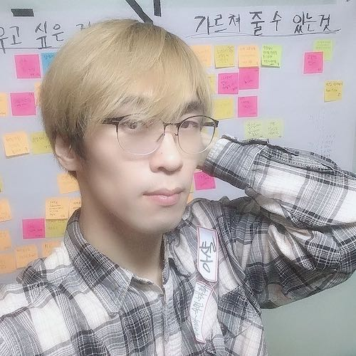](https://j.mp/3qOaPa9)

1월 16일 (수) - \#강남미술관 - “마녀의 초대장” 전시 관람.

책이 날아다니는 것처럼 연출된 곳이 있어서 거기서 찍은 사진을 한동안 프로필
사진으로 사용했는데, 사람들이 어떻게 찍은 거냐고 자주 물어봤다.

1월 18일 (금) - “[코딩의 신 아샬](https://j.mp/2zQxElp)” 유튜브 채널 구독자 5천
명 돌파.

1월 22일 (화) - GDG Seoul New years Meetup -
“[개발자, 한 달에 책 한 권 읽기 2018년 결산](https://j.mp/2WIe1oY)”

1월 25일 (금) ~ 2월 22일 (금) - Friday Night Training

Git & GitHub, Docker, TDD, CI를 각자 독립적으로 다뤘지만 사실 이게 모두 하나로
연결된다는 점을 강조하고 싶었다.

이 모두를 하나로 연결하는 흐름은 다음에도 다시 시도했는데, 2020년에는 좀 더
강조해서 다시 해보고 싶다.

1월 31일 (목) - 제 1회 달랩 기술 세미나 “Rails와 Vue.js로 복잡한 데이터 다루기”

매달 기술 세미나를 열어서 지식 공유도 하고 달랩 홍보도 하자고 생각했는데 이때
한번 진행하고 다음엔 계속 바빠서 못 했다.

참석자들에게 받은 글을 읽는 영상도 찍었는데, 너무 길어서 결국 편집을 완료 못
했다.

## 2월

2월 9일 (토) - 2019년 신년회 “자 이제 시작이야”

2월 10일 (일) - 달랩 멘토링 1기 모집

유튜브를 통해 멘토의 중요성을 강조했지만 “그래서 어쩌라고?”라는 근본적인 문제를
해결할 수 없었는데, 이 문제를 커뮤니티와 일정한 프로그램을 통해 해결하고 싶다는
생각에 일단 시작했다.

생각보다 많은 사람이 모엿고, 처음 생각과 다른 상황이 돼서 고민이 많았다.

2월은 평일 저녁, 주말 할 것 없이 멘티 면담으로 가득찬 일정이었다.

다른 생각 및 배운 점에 대해서는 [달랩 멘토링 2019년 회고](https://j.mp/37R5epT)
참고.

멘티 모집을 하면서 [달랩 홈페이지](https://j.mp/2DvViVs)를 처음으로 공개했다.

## 3월

3월 6일 (수) - [달랩 멘토링](https://j.mp/2MkJKrJ) 시작

이때 만든 페이스북 비공개 그룹이 지금까지 유용하게 쓰이고 있다. 일단 커뮤니티가
만들어지고, 그 위에 무언가를 얹는 게 효과적인 것 같다.

3월 7일 (목) - 밴드 다운더라인 Single 발매 -
“[Broken Memories](https://j.mp/2Qyc7EY)”

내가 좋아하는 노래 스타일 중 하나가 바로 랩으로 가다가 후렴에서 고음으로 지르는
건데, 여기에 속하는 노래 둘을 작년 말에 녹음해서 올해 음원으로 내놓게 됐다.

내가 내 노래에 취하는 게 이상할 수 있겠지만, 정말 좋다.

3월 9일 (토) - iMac Pro 언박싱

2년 할부로 구입한 달래님의 iMac Pro를 개봉했다.

3월 13일 (수) ~ 4월 15일 (수) - 학습신공

창준님께 야생학습을 배울 수 있는 “학습신공”을 준비하고 참석했다. 총 4회였는데,
마지막 날(4/30)엔 참석을 못 했다.

학습과 성장에 대한 생각을 다시 정리할 수 있었고, 애자일 축제와 마찬가지로
2019년에 큰 영향을 끼쳤다.

3월 19일 (화) - [데잇걸즈 3기](https://j.mp/2rLxLNB) 첫 미팅

영웅님을 만나서 데잇걸즈란 교육 프로그램에 대한 이야기를 듣고 취지에 공감해
합류했다.

올해 나에게 큰 영향을 준 커다란 사건(?) 둘을 꼽는다면, 하나는 달랩 멘토링이고
다른 하나는 데잇걸즈다. 의외로 둘 다 연초에 시작됐고, 실질적인 변화는 연말에
이뤄졌다.

## 4월

4월 11일 (목) ~ 5월 1일 (수) - Today's Lecture

블록체인에서 사용하는 기술과 “GoF의 디자인 패턴” 1장에 나온 객체지향을
온라인으로 강의했다.

4월 24일 (수) ~ 5월 15일 (수) - 달랩 BASIC CLASS: JavaScript로 익히는 자료구조와
알고리즘 #1

DSA의 탈을 쓴 짝 프로그래밍과 TDD 수업이었다.

프로그래밍하는 습관을 완전히 바꿀 수 있는 혁명적인 수업이었다고 자부한다.

[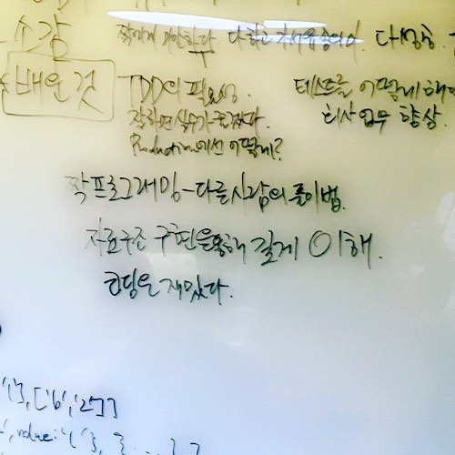](https://j.mp/2X4D05t)

4월 25일 (목) ~ 5월 30일 (목) - 만들면서 배우는 블록체인

4월 27일 (토) - 달랩 멘토링 모임 #1

4월 29일 (월) - 패스트캠퍼스 온라인 강의 미팅

맨 처음엔 이 제안이 좀 이상했는데, Java는 내가 좋아하지 않는 언어고 Spring은
실무에서 안 쓴지 좀 됐기 때문이다. 달래님과 상의를 하고 좋은 기회로 받아들이기로
했는데, 결과적으론 내 성장에 크게 도움이 된 것 같다.

사람들이 어떤 기술에 관심을 가지고 있는지 파악하고, 내가 어떻게 올바른 지식을
전달할 수 있는지 실험할 수 있었다.

## 5월

5월 18일 (토) - 진로 인터뷰

고등학생 8명의 학교 과제인 진로 인터뷰를 진행했다.

나도 중학생 때 내가 읽은 책 저자를 찾아가서 인터뷰를 했던 기억이 생생하다.

5월 22일 (수) - SASEUL Origin Conference

[초보자를 위한 블록체인의 기반 기술 설명](https://j.mp/2ST8D2H)

## 6월

6월 1일 (토) - 달랩 멘토링 모임 #2

6월 5일 (수) - 현대오토에버 컨설팅

6월 13일 (목) ~ 8월 28일 (수) - 패스트캠퍼스 온라인 강의 촬영

6월 20일 (목) - 우아한 객체지향 세미나 참석

[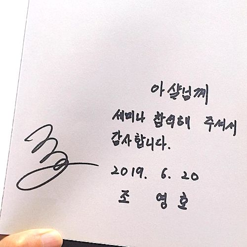](https://j.mp/2ZDExBu)

6월 21일 (금) ~ 7월 12일 (금) - Friday Night Training 2nd

6월 27일 (목) ~ 9월 4일 (수) - 패스트캠퍼스 온라인 강의 순차적 공개

[Fast Campus 올인원 패키지 자바 웹 개발](https://j.mp/2ZSHzAO)

6월 29일 (토) - Spring Seoul 참가

## 7월

7월 1일 (월) - “[코딩의 신 아샬](https://j.mp/2zQxElp)” 유튜브 채널 구독자 1만
돌파.

유튜브 구독자 1만 명은 목표로 삼고 있던 거라 꾸준히 영상을 올려서 그 목표를
달성했는데, 그 이후로는 추진력을 잃었다.

하지만 유튜브를 통해서 많은 기회를 얻었고, 많은 걸 배울 수 있었다.

7월 4일 (목) - 짝 작업 몰입 워크샵

7월 8일 (월) - 현대오토에버 디지털 신기술 특강: 코딩의 이해, 블록체인의 이해

Clean Code를 작성하기 위해 Feedback이 필요하다는 점과 이를 훈련하는 법을 정리할
수 있었다.

다른 곳에서도 워크샵 형태로 여러 번 반복했는데, 매번 효과가 좋았다.

관심 있는 회사는 [달랩에 문의](https://j.mp/2FbFJT6)하시라.

7월 16일 (화) ~ 11월 11일 (월) - 달랩 멘토링 짝 프로그래밍

달랩 멘토링 프로그램의 심장이라고 할 수 있다.

엄청나게 많은 걸 배웠고, 엄청나게 많은 걸 전달했다고 생각한다.

아샬에게 뭔가를 배우고 싶다면, 아샬과 함께 짝 프로그래밍을 하는 게 답이다.

7월 17일 (수) ~ 12월 13일 (금) - [데잇걸즈 3기](https://j.mp/2rLxLNB)

누군가의 인생에 결정적인 전환점이 될 수 있는 특별한 시간을 만들 수 있다면 얼마나
좋을까요?

정말 많은 걸 배우고 느낄 수 있는 시간이었습니다.

7월 17일 (수) ~ 10월 30일 (수) - GOOSGBT 온라인 스터디

[협력적 책 읽기](https://j.mp/2ZF6qcp) 참고.

7월 27일 (토) - 달랩 멘토링 모임 #3

## 8월

8월 17일 (토) - PyCon Korea 2019 라이트닝 토크 발표

8월 24일 (토) - “TDD로 프론트엔드 개발하기” 세미나

“관심사의 분리”란 키워드에 무게를 두고 진행한 세미나. 지금이라면 “클린 아키텍처”
등도 함께 활용해서 설명했을 것 같다.

[예제 코드](https://j.mp/36f20eN)

8월 31일 (토) - 달랩 멘토링 모임 #4

## 9월

9월 4일 (수) ~ 9월 18일 (수) - 독서&실천 모임

9월 5일 (목) - [달랩 멘토링](https://bit.ly/2MkJKrJ) 2기 모집

달랩 홈페이지를 리뉴얼하고, 멘토링 2기 모집을 시작하고, 블로그를 시작했다.

[달랩 블로그를 시작합니다](https://j.mp/2QfatsT)

9월 21일 (토) ~ 11월 30일 (토) - [달랩 멘토링](https://bit.ly/2MkJKrJ) 2기

9월 28일 (토) - 달랩 멘토링 모임 #5

## 10월

10월 5일 (토) ~ 11월 2일 (토) - 달토끼

달랩 사무실에서 토요일마다 모여서 뭔가 하려고 했다.

이것도 너무 바빠서 3번 밖에 못 했다.

10월 10일 (목) - 서초루비 “루비로 웹 게임 만들기” 발표

10월 15일 (화) ~ 11월 7일 (목) - [프로자백러](https://j.mp/35b7KpK) 1기

[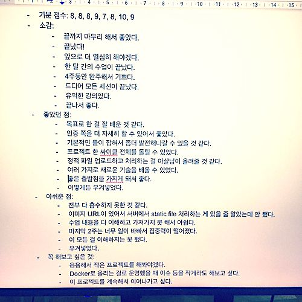](https://j.mp/2QA07mm)

10월 12일 (화) ~ 12월 5일 (목) - [프로자백러](https://j.mp/35b7KpK) 2기

[프로자백러 2기를 모집합니다](https://j.mp/2NiQeJ4)

[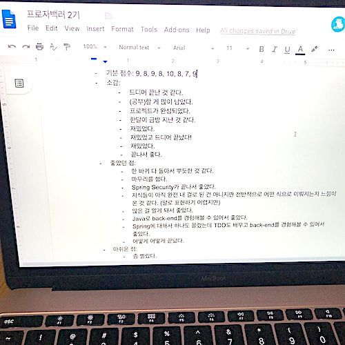](https://j.mp/39yVHoz)

10월 22일 (화) ~ 12월 17일 (화) - 코딩 도장

드디어 코딩 도장을 다시 부활시켰다. 오프라인 모임을 기준으로 하면 2008년에 처음
가졌으니, 11년만에 부활한 것.

10월 26일 (토) - 달랩 멘토링 모임 #6

## 11월

11월 1일 (금) - [마이크로프로텍트](https://j.mp/microprotect) 컨설팅

가벼운 마음으로 갔는데 이후 CTO가 됐다.

[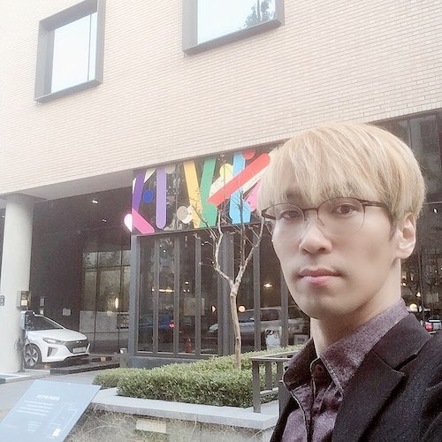](https://j.mp/2F8Uxlv)

11월 18일 (월) - [마이크로프로텍트](https://j.mp/microprotect)에 CTO로 합류

[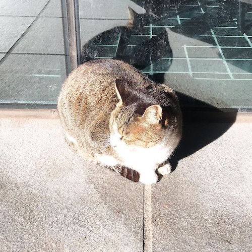](https://j.mp/39yVhP1)

11월 23일 (토) - 마소콘 2019

사람들을 만나는 건 언제나 즐거운 일이지!

[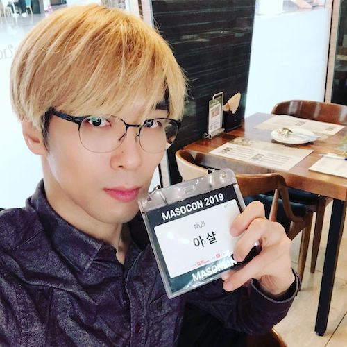](https://j.mp/2FcCaME)

11월 30일 (토) - 달랩 멘토링 모임 #7

## 12월

12월 6일 (금) - [마이크로프로텍트](https://j.mp/microprotect) 홈페이지 오픈

['세상에 하나뿐인 보험사'를 세상에 처음 공개하는 날](https://j.mp/2MHHvQ4)

[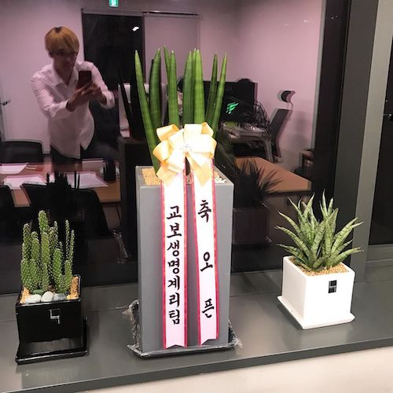](https://j.mp/2Qf2qfG)

12월 13일 (금) - 데잇걸즈 데모데이

[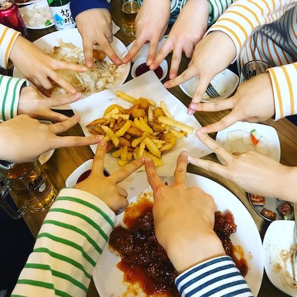](https://j.mp/2EdDbU3)

12월 24일 (화) ~ 12월 25일 (수) - 초콜릿파우더 크리스마스 파티

[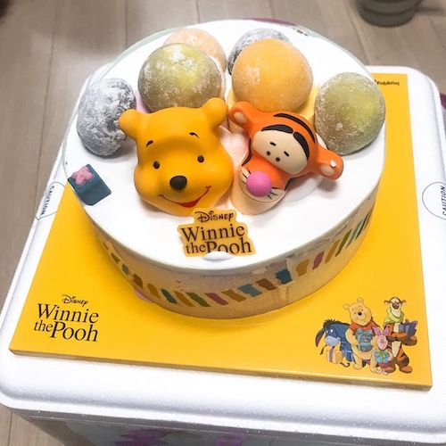](https://j.mp/2SJNSpO)

12월 26일 (목) - 달랩 멘토링 모임 #8 (송년회)

[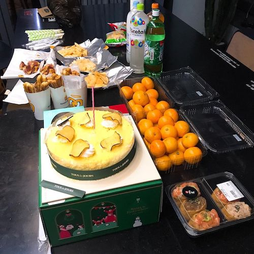](https://j.mp/36eMOyn)

12월 27일 (금) - 임프로그 홈커밍데이 참석

어릴 때부터 연극 같은 걸 좋아했고, 여전히 재밌는 것 같다.

12월 28일 (토) - 안녕 2019, 안녕 파이썬 2 참석

[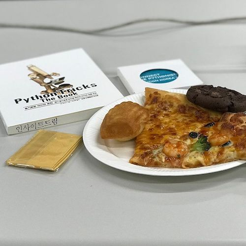](https://j.mp/2SFod1D)

## 개발자, 한 달에 책 한 권 읽기

- 1월 21일 (월) - “함께 자라기”
- 2월 18일 (월) - “프로그래밍 수련법”
- 3월 18일 (월) - “피플웨어”
- 4월 22일 (월) - “어떻게 문제를 풀 것인가”
- 5월 20일 (월) - “그들은 알고리즘을 알았을까”
- 6월 17일 (월) - “데브옵스 핸드북”
- 7월 22일 (월) - “오브젝트”
- 8월 19일 (월) - “읽기 좋은 코드가 좋은 코드다”
- 9월 23일 (월) - “클린 아키텍처”
- 10월 21일 (월) - “클린 코더”
- 11월 18일 (월) - “자바와 JUnit을 활용한 실용주의 단위 테스트”
- 12월 23일 (월) - “심플 소프트웨어”

## 기업 강의 및 컨설팅

유튜브와 여러 경로를 통해 몇몇 기회가 있었고, 준비하는 과정 및 문제를 해결하는
과정에서 내가 더 많이 배울 수 있었다.

## 2020년에 할 것

1. 책 많이 읽기. 올해는 완독율이 너무 낮았다. 다양한 분야에 과감히 도전하자.
2. 달랩 멘토링을 워크샵과 짝 프로그래밍 중심으로 진행하기. 배움을 나누는
   공동체를 강화하자.
3. 개발자 채용 및 교육. 마이크로프로텍트 CTO로서 가장 큰 역할이라고 생각한다.
4. 게임 만들기. 많은 사람에게 즐거움을 제공하고, 합당한 댓가를 받자.
5. 교육에 투자하기. 외국어, 운동 등을 포함해서 나를 더 강하게 만들 것에 시간과
   돈을 투자한다.

## BONUS

[아샬의 2018년 회고](https://j.mp/2Ari9zI).

“[개발자 회고 모음](https://j.mp/2tjY2CW)”이란 GitHub 저장소가 있다. 다른
개발자들이 어떻게 살았고 무엇을 배웠는지 궁금하면 방문해서 살펴보자.

---

- [아듀 2019!](https://adieu2019.ahastudio.com/)
- 이전 글: [2019년 회고: 비전공자에서 개발자가 되기까지](https://j.mp/36gz7Pc)
