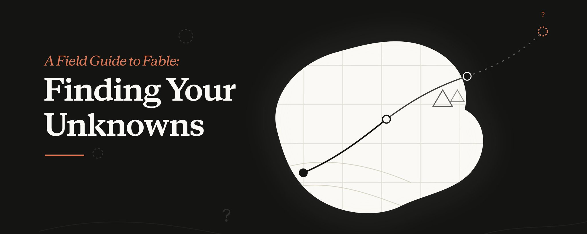
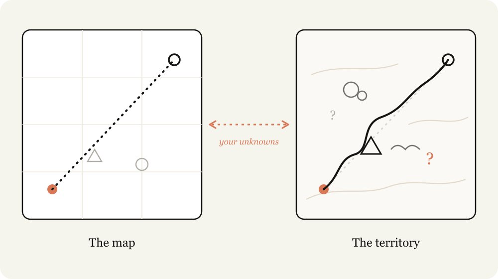
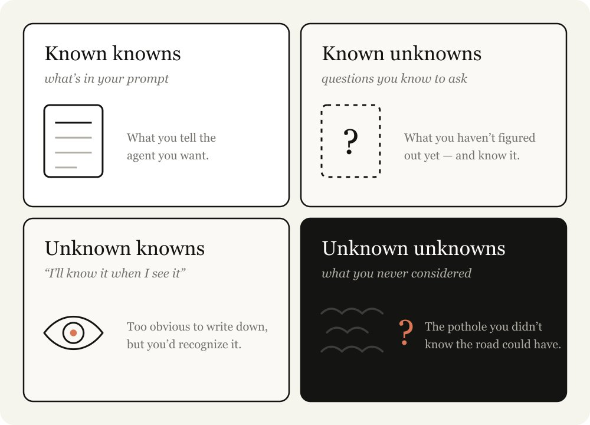
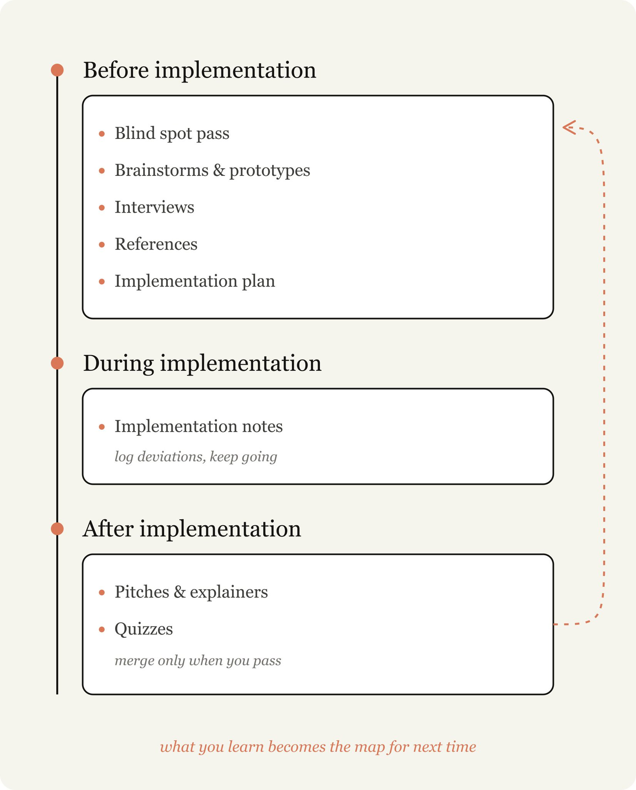
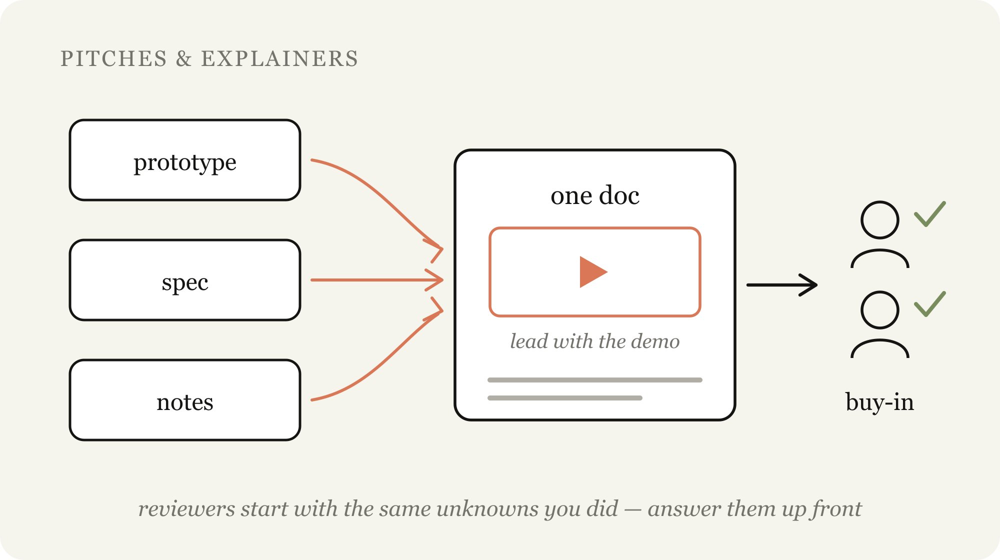

# A Field Guide to Fable: Finding Your Unknowns

원문: <https://twitter.com/trq212/status/2073100352921215386>

## 요약

Anthropic의 Thariq(@trq212)이 쓴 이 글은 Claude Fable 5와 작업하면서
얻은 교훈을 “지도는 영토가 아니다”라는 은유로 설명한다.
지도는 사용자가 Claude에게 주는 프롬프트, 스킬, 컨텍스트이고, 영토는
실제로 작업이 일어나는 코드베이스와 현실의 제약이다.
이 둘 사이의 간극을 저자는 “unknowns(모르는 것)”이라고 부른다.
Claude가 unknown에 부딪히면 사용자의 의도를 최선으로 추측해 결정을
내려야 하는데, Fable은 이 unknowns를 명확히 하는 사용자의 능력이
작업 품질의 병목이 되는 첫 모델이라고 저자는 말한다.

저자는 unknowns를 4가지로 분류한다.
Known Knowns(프롬프트에 이미 담긴 것), Known Unknowns(아직 파악하지
못했다는 것을 스스로 아는 것), Unknown Knowns(말로 정의하진 않았지만
보면 알아볼 수 있는 것), Unknown Unknowns(아예 고려조차 하지 못한
것)이다.
뛰어난 에이전틱 코더일수록 unknowns가 적은데, 이는 코드베이스와 모델
행동 양쪽에 깊이 동기화되어 있기 때문이다.
Claude 지시는 섬세한 균형이 필요한데, 너무 구체적이면 방향 전환이
필요한 순간에도 지시를 그대로 따르고, 너무 모호하면 업계 표준 관행에
기반한 임의의 가정을 하게 된다.

저자는 unknowns를 찾는 구체적인 기법들을 구현 전(Pre-implementation),
구현 중(During implementation), 구현 후(Post-implementation) 세
단계로 나누어 제시한다.
구현 전 단계에는 Blind Spot Pass(맹점을 Claude에게 찾아달라고
요청하기), Brainstorms and prototypes(프로토타입으로 unknown
knowns를 조기에 드러내기), Interviews(Claude가 모호한 지점을
역으로 질문하게 하기), References(코드나 디자인 레퍼런스를 직접
가리키기), Implementation Plans(변경 가능성이 큰 부분부터 검토하는
계획서 작성)가 있다.
구현 중에는 임시 implementation-notes.md 파일에 계획에서 벗어난
결정들을 기록하게 한다.
구현 후에는 Pitches and explainers(프로토타입, 스펙, 노트를 하나의
문서로 묶어 승인을 구하기)와 Quizzes(변경 사항을 완전히 이해했는지
스스로 퀴즈로 검증한 뒤에만 머지하기)를 제안한다.

글의 후반부는 Fable 출시 영상 제작 사례로 이 방법론을 실증한다.
저자는 영상 편집이 낯선 영역이었지만, 아는 것(Claude가 ffmpeg로
정확하게 편집할 수 있는지)에서 출발해 Remotion 프로토타입으로
검증하고, 색보정처럼 “좋다”의 기준조차 몰랐던 부분은 Claude에게
가르쳐 달라고 요청하는 방식으로 자신의 unknowns를 좁혀 나갔다.
결론에서 저자는 “검증이 항상 병목”이라는 취지로, 모델이 좋아질수록
접근법의 중요성이 커지며, 장기 과제가 잘못된 결과로 돌아온다면
unknowns를 정의하는 데 더 시간을 써야 한다고 말한다.

## 분석

### “지도-영토” 은유는 에이전트 실패를 커뮤니케이션 문제로 재정의한다

이 글의 핵심 수사적 장치는 코지프스키(Korzybski)의 “지도는 영토가
아니다”라는 오래된 명제를 에이전틱 코딩에 적용한 것이다.
이 은유의 힘은 에이전트의 실패를 모델 능력의 한계가 아니라 지도
제작(프롬프트 작성)의 불완전성으로 재배치한다는 데 있다.
즉 “Claude가 틀렸다”가 아니라 “내가 준 지도가 영토를 충분히
반영하지 못했다”는 프레임으로 문제를 이동시킨다.

이 프레임 전환은 실천적으로 중요한 함의를 가진다.
모델 성능이 향상될수록 병목이 모델에서 사용자로 옮겨간다는 저자의
관찰은, 도구가 좋아질수록 도구를 다루는 사람의 역량이 상대적으로
더 크게 부각된다는 일반적인 자동화 역설과 맞닿아 있다.
Fable이 “unknowns를 명확히 하는 능력이 병목”이라는 진단은, 결국
에이전트 시대의 실력이 코딩 능력이 아니라 자기 자신의 무지를
발견하는 메타 인지 능력으로 이동하고 있음을 시사한다.

### 4분면 분류는 소크라테스적 무지의 개념을 실무 체크리스트로 변환한다

Known Knowns, Known Unknowns, Unknown Knowns, Unknown Unknowns라는
4분면은 도널드 럼즈펠드의 유명한 발언에서 차용한 개념이지만, 저자는
여기에 Unknown Knowns라는 세 번째 범주를 실질적으로 활용 가능한
형태로 다듬었다.
“말로 정의하진 않았지만 보면 안다”는 것은 암묵지(tacit knowledge)의
정의와 정확히 일치하는데, 저자는 이것을 프로토타입과 브레인스토밍을
통해 명시적으로 드러내야 할 대상으로 규정한다.

이 분류가 흥미로운 이유는 각 사분면마다 서로 다른 처방을 요구한다는
점이다.
Known Unknowns는 Interviews(질문)로, Unknown Knowns는 Brainstorms와
prototypes(시각화)로, Unknown Unknowns는 Blind Spot Pass(Claude의
탐색력 활용)로 대응한다.
즉 이 글은 단순한 개념 분류가 아니라, 분류마다 정확히 대응하는
기법을 짝지어 놓은 처방전 구조를 취하고 있다.

### 시간 축(사전·중간·사후) 구조는 검증 비용을 최소화하려는 경제적 논리를 따른다

저자가 unknowns 발견 기법을 Pre/During/Post-implementation 세
단계로 나눈 것은 단순한 편의적 분류가 아니라, “발견이 늦어질수록
수정 비용이 커진다”는 소프트웨어 공학의 오래된 원칙을 그대로
반영한다.
브레인스토밍과 프로토타입을 구현 전 단계에 배치한 이유를 저자가
직접 “구현 중에 이를 찾아내는 것은 상대적으로 비쌀 수 있다”고
설명하는 대목이 이를 뒷받침한다.

이 구조는 폭포수 모델의 요구사항 분석 단계가 존재하는 이유와
본질적으로 같다.
다른 점은, 전통적 요구사항 분석이 인간 이해관계자와의 소통을
전제로 하는 반면, 이 글의 방법론은 그 소통 상대가 Claude라는
점이다.
Implementation notes를 구현 중 단계에 두어 “계획에서 벗어난 결정”을
기록하게 하는 것은, 사전에 모든 unknowns를 제거하는 것이 불가능하다는
것을 인정하면서도 그 실패를 다음 회차의 자산으로 전환하려는
루프 구조를 만든다.

## 비평

### “구체성과 모호함 사이의 섬세한 균형”이라는 처방은 균형점을 찾는 방법을 제시하지 않는다

저자는 “너무 구체적이면 방향 전환의 기회를 놓치고, 너무 모호하면
엉뚱한 가정을 하게 된다”고 지적하지만, 그 중간 지점을 어떻게
찾는지에 대한 구체적인 방법론은 제공하지 않는다.
이는 이 글 전체의 구조적 약점으로 이어지는데, 4가지 unknowns
분류와 여러 기법을 제시하면서도 “지금 내 상황에서 어떤 기법을
언제 써야 하는가”를 결정하는 상위 판단 기준이 없다.

실제로 저자 스스로도 “모든 기법을 매번 쓰지는 않는다”고 인정하면서
“어떤 상황에 어떤 기법을 쓸지 직관을 기르라”는 조언으로 마무리한다.
이는 사실상 “경험을 쌓아서 알아서 판단하라”는 것과 다르지 않다.
숙련자의 암묵지를 언어화하겠다는 글의 목표 자체가, 가장 중요한
결정 지점(어떤 기법을 언제 쓸지)에서는 다시 암묵지로 돌아가는
순환 구조에 빠진다.

### Boris와 Jarred를 인용한 근거는 일반화 가능성을 검증하지 않은 일화다

저자는 뛰어난 에이전틱 코더의 예로 Boris Cherny와 Jarred Sumner
두 명을 언급하며 “그들은 unknowns가 적다”고 설명한다.
그러나 이 관찰은 두 명의 특출난 개인 사례에서 나온 것으로, 이들이
정말 unknowns가 적어서 뛰어난 것인지, 아니면 뛰어나기 때문에
사후적으로 unknowns가 적어 보이는 것인지 인과관계가 불분명하다.

더 큰 문제는 이 예시가 반증 불가능한 순환 논리를 이룬다는 점이다.
“뛰어난 코더는 unknowns가 적다”는 주장과 “unknowns를 줄이면
뛰어난 코더가 된다”는 처방은 논리적으로 같은 명제가 아니다.
전자는 상관관계의 관찰이고 후자는 인과적 개입인데, 글은 이 둘을
검증 없이 동일시한다.
숙련자 두 명의 일화가 초보자에게 실천 가능한 인과적 처방으로
직결된다는 보장은 없다.

### 구현 노트와 퀴즈 기법은 검증 비용을 사용자에게 그대로 이전한다

Implementation notes와 Quizzes는 이 글에서 가장 실무적으로
유용해 보이는 기법이지만, 동시에 검증 부담을 사용자에게 되돌리는
구조라는 점이 은폐되어 있다.
저자는 “코드 diff를 읽는 것만으로는 가벼운 이해밖에 얻지 못한다”고
말하며 퀴즈를 통과해야만 머지한다고 하는데, 이는 결국 Claude가
작업량을 늘릴수록 사용자가 검토에 써야 하는 인지적 노력도
비례해서 커진다는 것을 의미한다.

이는 에이전틱 코딩의 약속—“작업을 위임해서 시간을 아낀다”—과
정면으로 긴장 관계에 있다.
글은 이 긴장을 명시적으로 다루지 않고 퀴즈를 통과 의례처럼
제시하는데, 실제로 대규모 변경마다 매번 완벽한 퀴즈를 통과해야
한다면 그 시간이 직접 코드를 읽는 시간보다 짧다는 보장이 없다.
저자가 제시하는 방법론은 위임의 총량이 늘어날수록 검증의 총량도
함께 늘어난다는 사실을 감춘 채 “이렇게 하면 안전하게 위임할 수
있다”는 인상만 남긴다.

### Fable 출시 영상 사례는 성공 사례 편향에 의존한다

글의 후반부에 등장하는 Fable 출시 영상 제작 사례는 이 방법론이
실제로 작동했다는 유일한 구체적 증거다.
그러나 이 사례는 저자 자신이 직접 수행하고 성공적으로 마무리한
단 하나의 사례이며, 이 방법론을 적용했지만 실패했거나 시간을
오히려 더 많이 쓴 사례는 언급되지 않는다.

방법론을 제안하는 글에서 성공 사례만 제시하는 것은 흔한 서술
전략이지만, 검증 관점에서는 취약하다.
색보정처럼 “좋다”의 기준을 몰랐던 영역에서 Claude에게 배우는
방식이 통했다는 것이, 예를 들어 법률이나 의료처럼 오답의 대가가
큰 도메인에서도 동일하게 작동할지는 전혀 다른 질문이다.
글은 이 방법론의 적용 범위에 대한 경계 조건을 논의하지 않는다.

## 인사이트

### unknowns 프레임워크는 결국 에이전트 신뢰도의 새로운 측정 단위를 제안한다

이 글이 명시하지 않지만 함의하는 것은, “자율성 레벨”이나 “신뢰
사다리” 같은 기존의 에이전트 성숙도 논의와는 다른 측정 축을
제안하고 있다는 점이다.
기존 논의들이 “얼마나 맡길 수 있는가”를 측정한다면, 이 글은
“사용자가 자신의 무지를 얼마나 정확히 지도화할 수 있는가”를
측정한다.
이는 에이전트의 역량이 아니라 사용자의 자기 인식 역량을 병목으로
지목한다는 점에서 방향이 반대다.

이 관점을 끝까지 밀어붙이면, 향후 에이전틱 코딩 도구의 경쟁
우위는 “얼마나 똑똑한 모델을 만드는가”에서 “사용자가 자신의
unknowns를 얼마나 쉽게 드러내도록 돕는가”로 이동할 수 있다.
Blind Spot Pass처럼 에이전트가 스스로 사용자에게 질문을 던지는
기능은, 결국 모델이 자신의 불확실성을 사용자에게 능동적으로
드러내는 인터페이스 설계 문제로 이어진다.
이는 프롬프트 엔지니어링이 아니라 “무지 발견 인터페이스”라는
새로운 UX 카테고리의 시작으로 읽을 수 있다.

### 임시 기록 파일(implementation-notes.md) 관행은 조직 지식 관리의 축소판을 재현한다

에이전트에게 “결정과 이탈을 기록하는 임시 파일을 유지하라”고
지시하는 관행은, 소프트웨어 조직이 오랫동안 씨름해온 문제, 즉
암묵적 결정을 명시적 기록으로 전환하는 문제의 축소판이다.
전통적 조직에서 이는 ADR(Architecture Decision Record)이나 RFC
문서로 제도화되어 왔는데, 에이전트 시대에는 이 기록 행위 자체를
에이전트에게 위임할 수 있다는 것이 새로운 지점이다.

그러나 이 위임에는 감춰진 위험이 있다.
인간이 ADR을 쓸 때는 “이 결정을 미래의 나 또는 동료가 이해해야
한다”는 의식적 필터가 작동하지만, 에이전트가 스스로 기록을
남길 때는 그 필터가 에이전트의 판단에 맡겨진다.
에이전트가 “기록할 가치가 있다”고 판단하는 기준이 사용자의
기준과 항상 일치하지 않는다면, implementation-notes.md는
누적될수록 신뢰할 수 없는 사료가 될 위험이 있다.
이는 회사 위키가 방치되면 오히려 최신 정보를 찾기 어렵게
만드는 것과 같은 실패 패턴을 반복할 가능성이 있다.

### “질문하는 에이전트”로의 전환은 에이전트 설계 철학의 근본적 재배치를 요구한다

Blind Spot Pass와 Interviews 기법은 공통적으로 에이전트가 먼저
질문하는 역할을 맡도록 요구한다.
이는 초기 챗봇과 에이전트 설계 철학의 기본 전제, 즉 “사용자의
요청을 최대한 그대로 실행하는 것이 좋은 에이전트”라는 전제와
정면으로 배치된다.
질문을 많이 하는 에이전트는 실행 속도가 느려 보이지만, 이 글의
논리대로라면 그 지연이야말로 unknowns를 사전에 제거해 전체
작업 시간을 단축시키는 투자다.

이 전환이 흥미로운 지점은, 결국 좋은 에이전트의 정의가 “빠르게
실행하는 것”에서 “언제 멈추고 물어야 하는지 아는 것”으로 옮겨가고
있다는 데 있다.
이는 별도로 진행된 대규모 세션 데이터 분석에서 “에이전트가
명확화 요청을 사용자 개입 요청보다 두 배 이상 많이 한다”는
관찰과도 공명한다.
결국 에이전트의 진짜 실력은 작업을 얼마나 잘 해내느냐가 아니라,
스스로의 불확실성을 얼마나 정확히 인지하고 적시에 드러내느냐로
재정의되고 있으며, 이는 에이전트 평가 지표 자체가 산출물
품질에서 메타인지 정확도로 이동할 가능성을 시사한다.