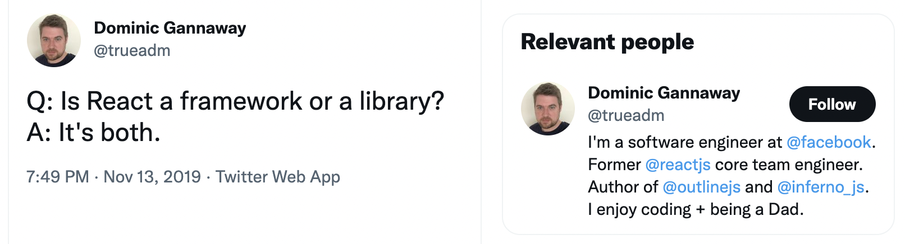

# React - A JavaScript library for building user interfaces

<https://reactjs.org/>

<https://github.com/facebook/react>

## both

[Dominic Gannaway on Twitter: "Q: Is React a framework or a library? A: It's both." / Twitter](https://twitter.com/trueadm/status/1194567962784653312)

## React 버전 15

[New Versioning Scheme – React Blog](https://reactjs.org/blog/2016/02/19/new-versioning-scheme.html)

> Today we’re announcing that we’re switching to major revisions for React.
> The current version is 0.14.7. The next release will be: 15.0.0

## React 버전 17

[Introducing the New JSX Transform](https://reactjs.org/blog/2020/09/22/introducing-the-new-jsx-transform.html)

## React 버전 18

[The Plan for React 18 – React Blog](https://reactjs.org/blog/2021/06/08/the-plan-for-react-18.html)

[React 18: An overview of its new features and updates | DhiWise](https://medium.com/dhiwise/react-18-new-features-and-updates-2e608d862a6d)

## React Compiler

[I tried React Compiler today, and guess what... 😉](https://www.developerway.com/posts/i-tried-react-compiler) \
→ 한국어 번역:
[오늘 리액트 컴파일러를 사용해 봤는데, 어땠을 것 같나요? 😉 | by Jung Han | Jun, 2024 | Medium](https://junghan92.medium.com/%EC%98%A4%EB%8A%98-%EB%A6%AC%EC%95%A1%ED%8A%B8-%EC%BB%B4%ED%8C%8C%EC%9D%BC%EB%9F%AC%EB%A5%BC-%EC%82%AC%EC%9A%A9%ED%95%B4-%EB%B4%A4%EB%8A%94%EB%8D%B0-%EC%96%B4%EB%95%A0%EC%9D%84-%EA%B2%83-%EA%B0%99%EB%82%98%EC%9A%94-ece57f076b02)

## Rules of React

<https://react.dev/reference/rules>

## React Patterns

<https://reactpatterns.com/>

## Deep dive into React codebase

EP1: Prerequisites
<https://dev.to/fromaline/deep-dive-into-react-codebase-ep1-prerequisites-33ak>

EP2: What package from the repo is the most popular on npm?
<https://dev.to/fromaline/deep-dive-into-react-codebase-ep2-what-package-from-the-repo-is-the-most-popular-on-npm-2328>

EP3: Reverse engineer the most famous React snippet
<https://dev.to/fromaline/deep-dive-into-react-codebase-ep3-reverse-engineer-the-most-famous-react-snippet-njj>

EP4: How ReactDOM.render works
<https://dev.to/fromaline/deep-dive-into-react-codebase-ep4-how-reactdomrender-works-32n6>

## Rendering

[State: A Component's Memory – React](https://react.dev/learn/state-a-components-memory)
→ 한국어 번역:
[State: 컴포넌트의 메모리 – React](https://react-ko.dev/learn/state-a-components-memory)

[Render and Commit – React](https://react.dev/learn/render-and-commit) \
→ 한국어 번역:
[렌더링하고 커밋하기 – React](https://react-ko.dev/learn/render-and-commit)

[State as a Snapshot – React](https://react.dev/learn/state-as-a-snapshot)
→ 한국어 번역:
[스냅샷으로서의 state – React](https://react-ko.dev/learn/state-as-a-snapshot)

[재조정 (Reconciliation) – React](https://ko.legacy.reactjs.org/docs/reconciliation.html)

[React 렌더링 과정으로 알아보는 선언적이라는 의미](https://pozafly.github.io/react/declarative-meaning-of-react-rendering-process/)

[Why React Re-Renders](https://www.joshwcomeau.com/react/why-react-re-renders/) \
→ 한국어 번역:
[왜 리액트에서 리렌더링이 발생하는가](https://medium.com/@yujso66/%EB%B2%88%EC%97%AD-%EC%99%9C-%EB%A6%AC%EC%95%A1%ED%8A%B8%EC%97%90%EC%84%9C-%EB%A6%AC%EB%A0%8C%EB%8D%94%EB%A7%81%EC%9D%B4-%EB%B0%9C%EC%83%9D%ED%95%98%EB%8A%94%EA%B0%80-74dd239b0063)

## State Management

[Do You Know the 5 Types of States in React? | by Vithushan Jey](https://javascript.plainenglish.io/do-you-know-the-5-types-of-states-in-react-8734a04a5ffb)

[mobx vs recoil vs redux | npm trends](https://www.npmtrends.com/redux-vs-mobx-vs-recoil)

[State of JS 2020: Data Layer](https://2020.stateofjs.com/en-US/technologies/datalayer/)

- <https://github.com/ahastudio/til/blob/main/react/redux.md>
- <https://github.com/ahastudio/til/blob/main/react/mobx.md>
- <https://github.com/ahastudio/til/blob/main/react/recoil.md>
- <https://github.com/ahastudio/til/blob/main/react/hookstate.md>
- <https://github.com/ahastudio/til/blob/main/react/zustand.md>
- <https://github.com/ahastudio/til/blob/main/react/teaful.md>
- <https://github.com/ahastudio/til/blob/main/react/micro-state.md>
- <https://github.com/ahastudio/til/blob/main/react/use-change.md>

## Higher-Order Component (고차 컴포넌트)

<https://ko.reactjs.org/docs/higher-order-components.html>

[Do React Hooks Replace Higher Order Components (HOCs)? | by Eric Elliott | JavaScript Scene | Medium](https://medium.com/javascript-scene/do-react-hooks-replace-higher-order-components-hocs-7ae4a08b7b58)

## Router

- <https://github.com/ahastudio/til/blob/main/react/react-router.md>
- <https://github.com/ahastudio/til/blob/main/react/react-location.md>
- <https://github.com/ahastudio/til/blob/main/react/router5.md>

## React TypeScript Cheatsheets

- <https://github.com/typescript-cheatsheets/react>
- <https://react-typescript-cheatsheet.netlify.app/>

## React with TypeScript Cheatsheet

<https://blog.bitsrc.io/react-with-typescript-cheatsheet-9dd891dc5bfe>

## Bit: Component-driven development platform

> A tool for component-driven application development.

<https://bit.dev/>

<https://github.com/teambit/bit>

## 온라인 상점 예제

> A demo online clothing store built with TailwindCSS, React Hooks,
> Redux Toolkit, React Router 6

<https://github.com/oojr/demo-store>

## Excalidraw

> Virtual whiteboard for sketching hand-drawn like diagrams

<https://github.com/excalidraw/excalidraw>

<https://excalidraw.com/>

## usehooks-ts

> React hooks library, written in Typescript

<https://usehooks-ts.com/>

<https://github.com/juliencrn/usehooks-ts>

[Migrate to v3](https://usehooks-ts.com/migrate-to-v3)
- `useFetch` 없어짐.
  [SWR](https://swr.vercel.app/ko)을 쓰면 그나마 제일 비슷하다.
- `useEffectOnce` 없어짐. `useEffectOnce(effect)` 대신 `useEffect(effect, [])`를 쓰면 된다.
